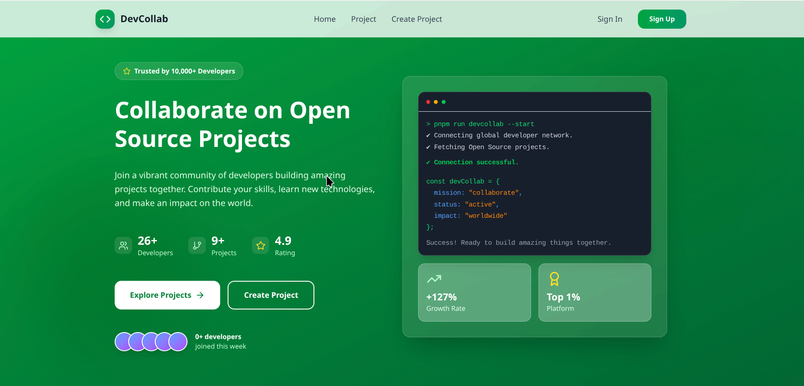
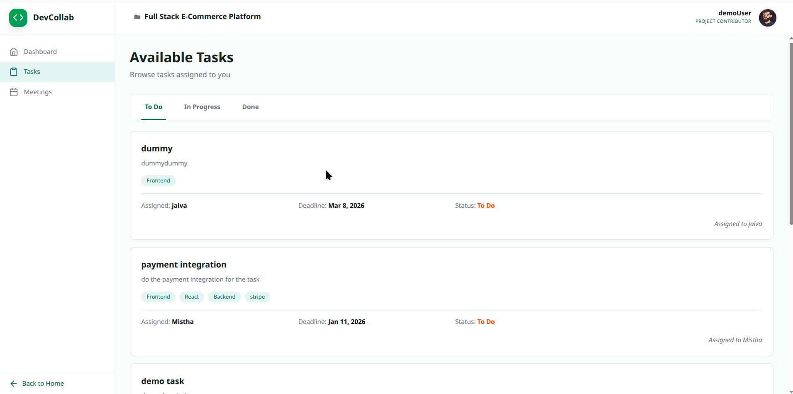
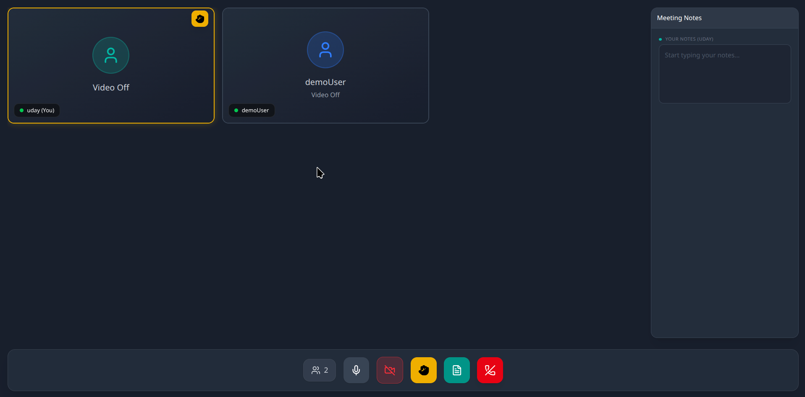
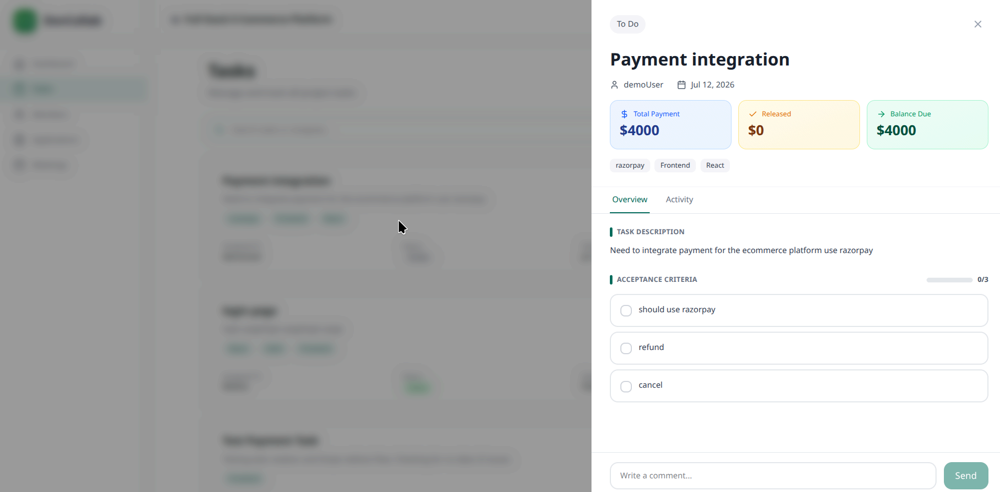

<div align="center">

<!-- ADD BANNER IMAGE HERE:
  To replace this banner:
  1. Add your banner image to a folder like `docs/screenshots/`
  2. Update the `src` below with the relative path to your image (e.g., `src="docs/screenshots/banner.png"`)
-->


# DevCollab UI — Seamless Developer Collaboration

**A workspace where code, conversation, and compensation live together.**  
Unifying project management, real-time communication, and secure financial transactions into a single beautiful ecosystem.

[](https://nextjs.org)
[](https://www.typescriptlang.org)
[](https://tailwindcss.com)
[](https://zustand-demo.pmnd.rs)

</div>

---

## 📋 Table of Contents

- [Overview](#-overview)
- [Screenshots](#-screenshots)
- [Core Capabilities](#-core-capabilities)
- [Engineering Excellence](#-engineering-excellence)
- [Getting Started](#-getting-started)
- [Backend Repository](#-backend-repository)

---

## 🌟 Overview

In a world where developers juggle Jira, Slack, Zoom, and Upwork, context switching kills productivity. **DevCollab** eliminates this friction. We provide a single pane of glass empowering distributed teams to build faster and more efficiently.

---

## 📸 Screenshots

### 1. Interactive Kanban Board
> Drag-and-drop tasks with sub-second synchronization. Discuss tasks right where the work happens.



### 2. In-App Video Conferencing
> Native high-quality screen sharing and one-click meetings for standups and pair programming.



### 3. Secure Escrow Dashboard
> Trust is built-in. Review milestone-based funds securely held via Stripe integrations.



---

## ✨ Core Capabilities

| Feature | Description |
|---------|-------------|
| ⚡ **Real-time Engine** | Every task update, comment, and chat message syncs instantly across clients using Socket.io. |
| 🎥 **Integrated Video** | Forget external meeting links. Low-latency built-in video calls for pair programming. |
| 💸 **Milestone Payments** | Smart secure escrow system powered by Stripe protecting both project owners and contributors. |
| 🎨 **Beautiful UI/UX** | A bespoke, responsive design system crafted with Tailwind CSS and HeroUI for modern aesthetics. |

---

## 💻 Engineering Excellence

This application is built with an absolute focus on **Performance**, **Scalability**, and **User Experience**.

- **Next.js 15 (App Router)**: Utilizing React Server Components for lightning-fast initial loads and SEO optimization.
- **TypeScript**: Strict type interactions ensuring robust, bug-free implementations.
- **TanStack Query & Zustand**: State-of-the-art state management separating server and client state efficiently.
- **Socket.io Client**: Optimistic UI updates for a "feels-instant" user experience.

---

## 🚀 Getting Started

### Prerequisites
- Node.js 20+

### Local Setup
1. **Clone the repository**
   ```bash
   git clone https://github.com/Arunjith5452/DevCollab-Frontend.git
   cd DevCollab-Frontend
   ```

2. **Install & Run**
   ```bash
   npm install
   npm run dev
   ```

3. **Explore**: Open [http://localhost:3000](http://localhost:3000) in your browser.

---

## 🔗 Backend Repository
This frontend is powered by a robust backend API designed with Clean Architecture.
👉 **[Explore the Backend Architecture](https://github.com/Arunjith5452/DevCollab-Backend)**

<div align="center">
  <strong>Crafted for maximum productivity.</strong>
</div>
